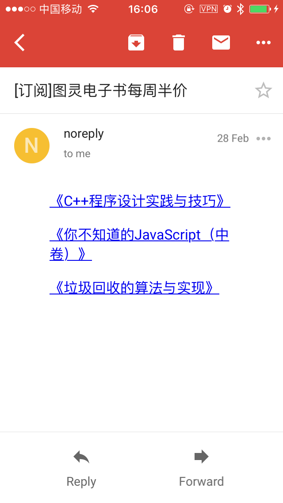

# Watchdog

IF (网页某区域有变化) THEN (提醒你)

## 编写规则

配置文件放在`fetchers`目录下

### Ruby 脚本监控

文件名以`.rb`结尾, 实现方式是定义一个函数, 函数内容是该脚本, 支持传递配置参数.

已有规则:
|     fetcher     |     |                   描述                    |
| --------------- | --- | :---------------------------------------- |
| bilibili-up     |     | B站UP主, 当前粉丝数, 获赞数等             |
| epic-free-games |     | Epic 每周免费游戏, UTC 时间每周四15点更新 |

### CSS Selectors 监控

文件名以`.yaml`结尾.

``` yaml
# file: fetchers/ituring.yaml
name: "图灵社区 - 每周特价"                        # 邮件标题(%s表示通配符)
url: "https://www.ituring.com.cn/tag/36527"     # 抓取的页面(%s表示通配符)
css_selectors: ".book-img"                      # 抓取的节点
```

对于 `css_selectors` 如何食用, 请搭配
[SelectorGadget](https://chrome.google.com/webstore/detail/selectorgadget/mhjhnkcfbdhnjickkkdbjoemdmbfginb).

已有规则:
|    fetcher     |     |           描述           |
| -------------- | --- | :----------------------- |
| ituring        |     | 图灵社区, 每周特价电子书 |
| smzdm-fenlei-x |     | 什么值得买, 分类         |
| smzdm-post-x   |     | 什么值得买, 用户发文     |
| smzdm-tag-x    |     | 什么值得买, 标签关键字   |
| smzdm-youhui-x |     | 什么值得买, 商品关键字   |
| smzdm          |     | 什么值得买, 首页热门     |

## 修改配置 (config.yaml)

### 发送者

暂时只支持邮件发送, 配置的模板已经写好, 需要修改的部分已经已经用`TODO`做了标记

注意: 单元测试默认开启了`测试邮件发送`, 如已测试通过, 请修改`test_sender`的值为`false`,
不然每次启动都会发送一次测试邮件.

### 其他

具体请看`config.yaml`, 可配置项包括代理配置, 用户配置, 订阅规则.

## 获取并运行

``` bash
git clone https://github.com/SaulLawliet/watchdog.git
cd watchdog

# 初始化环境
bin/setup

# 单元测试
rake spec

# 后台运行服务(内部会运行单元测试)
bin/watchdog &

# 进入 irb 命令行
bin/console
```

## 邮件截图

 
