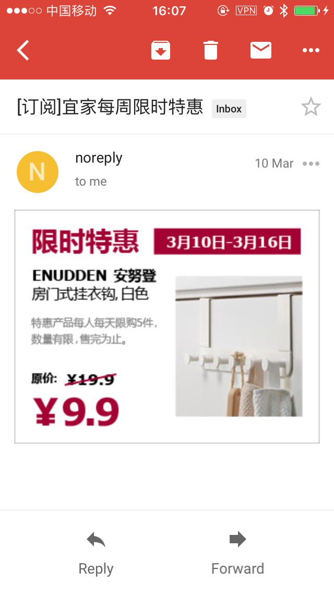

# Watchdog
IF (网页某区域有变化) THEN (邮件提醒你)

# 邮件截图
 

# 如何配置
1. 规则: 放在`rules`目录下, 文件名要以`.yaml`结尾, 格式如下
    ```
    # file: rules/ituring.yaml 
    name: "图灵社区动态"                              # 邮件标题({0}表示通配符)
    url: "http://www.ituring.com.cn/"               # 抓取的页面({0}表示通配符)
    css_selectors: ".eve-list dl:nth-child(1) dd"   # 抓取的节点
    ```
    对于 `css_selectors` 如何食用, 请搭配
    [SelectorGadget](https://chrome.google.com/webstore/detail/selectorgadget/mhjhnkcfbdhnjickkkdbjoemdmbfginb).
  
1. 其他: 详情见 [config.yaml](config.yaml)

# 获取并执行
```
git clone https://github.com/SaulLawliet/watchdog.git
cd watchdog
bundle install

# 如果第一次配置(或修改)邮件, 建议先发送一封测试邮件
ruby watchdog.rb -t

# 正式运行, 后台启动
ruby watchdog.rb &
```

